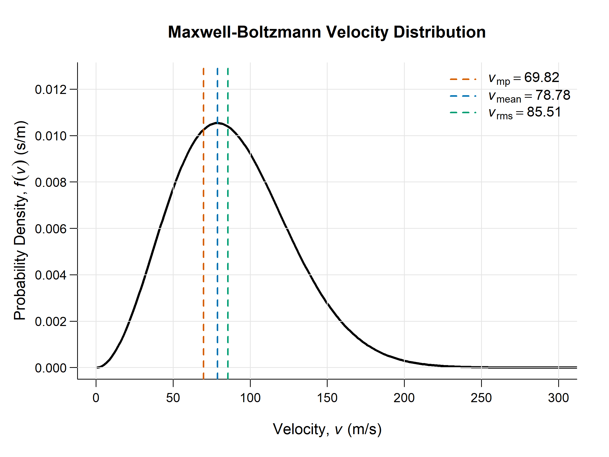

# Maxwell-Boltzmann Velocity Distribution


This repository contains a numerical routine developed in Python and R for calculating and visualizing the Maxwell-Boltzmann velocity distribution of an ideal gas. The code generates the probability density function $f(v)$ for a given temperature and molar mass, extracting the characteristic velocities of the thermodynamic system.

## Authorship

**Victor Moreira Acacio**

Institute of Astronomy, Geophysics and Atmospheric Sciences of the University of São Paulo

GitHub: [@OAkacio](https://github.com/OAkacio)

ORCID: [0009-0007-4484-2129](https://orcid.org/0009-0007-4484-2129)

## Installation

Clone this repository and install the Python dependencies by running the following commands in your terminal. Ensure that an R environment is also installed on your system to execute the plotting routine.

```bash
git clone https://github.com/OAkacio/maxwell-boltzmann-distribution.git
cd maxwell-boltzmann-distribution
pip install -r requirements.txt
```

## Usage

The workflow of this integrator is divided into two sequential steps: numerical data generation via Python and high-resolution visualization via R.

**1. Generate the distribution data:**
Execute the main engine to calculate the probability density and characteristic velocities.

```bash
python main.py
```

**2. Plot the results:**
Run the R script to process the generated `.txt` data and export the standardized scientific plot.

```bash
Rscript plot_main.R
```



**Note:** To change the macroscopic variables such as Temperature ($T$) and Molar Mass ($M$), edit the parameters inside `src/parameters.py` before running the integration engine.

## Theoretical Background

The mathematical foundation of this routine is based on the classical kinetic theory of gases. The code calculates the following physical quantities:

**1. Probability Density Function ($f(v)$)**
The probability of a particle having a velocity $v$ at a thermodynamic temperature $T$ for a gas of molar mass $M$ is given by:

$$f(v) = 4\pi \left( \frac{M}{2\pi R T} \right)^{3/2} v^2 \exp\left( -\frac{M v^2}{2 R T} \right)$$

**2. Most Probable Velocity ($v_{mp}$)**
The velocity possessed by the largest fraction of molecules in the gas, corresponding to the peak of the distribution curve:

$$v_{mp} = \sqrt{\frac{2 R T}{M}}$$

**3. Mean Velocity ($v_{avg}$)**
The arithmetic average of the velocities of all molecules within the thermodynamic system:

$$v_{avg} = \sqrt{\frac{8 R T}{\pi M}}$$

**4. Root-Mean-Square Velocity ($v_{rms}$)**
The square root of the average of the squared velocities, which is directly related to the average kinetic energy of the gas particles:

$$v_{rms} = \sqrt{\frac{3 R T}{M}}$$

## Project Structure

```text
├── data/           # Generated data files (.txt)
├── figures/        # High-resolution distribution plots (.png)
├── src/            # Core modules (core.py, parameters.py, utils.py)
├── main.py         # Python numerical integration engine
├── plot_main.R     # R plotting and visualization script
└── requirements.txt
```

## Motivation

This repository was developed as an auxiliary computational tool for the study of Thermodynamics and Statistical Mechanics. The central objective is to provide a reproducible numerical routine to visualize how the statistical distribution of particle velocities shifts according to macroscopic thermodynamic variables, offering a clear analytical visualization of ideal gas behavior.
